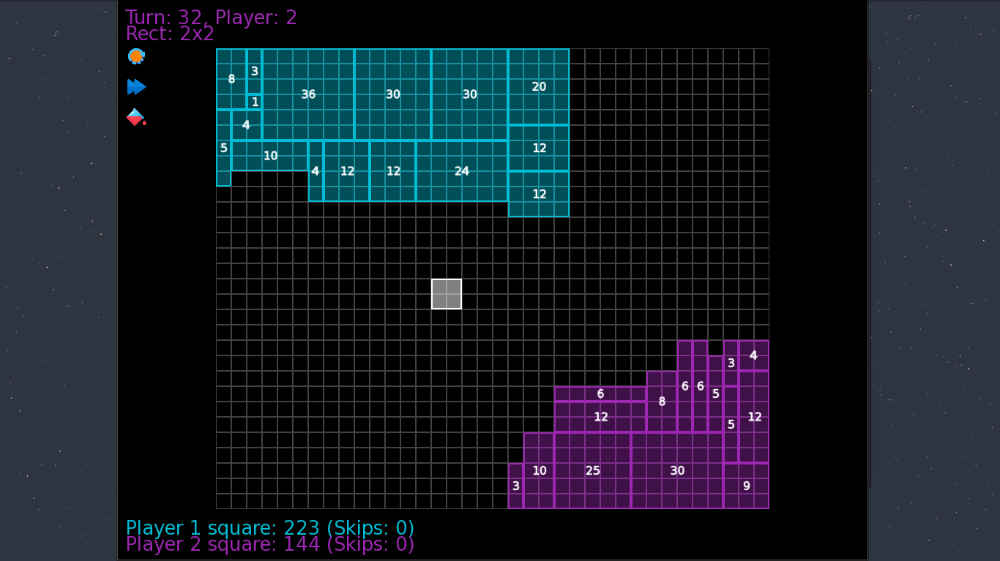

<h1 align="center">Cubes</h1>
<p align="center">Simple geometry game</p>
<br>

<div class="badges" align="center">
    <br><br>
    
    
</div>
<br>
<div class"screenshots" align="center">
    </img>
</div>
<br>
<h1 align="center">Installing</h1>

<a href="https://www.sfml-dev.org/"><p align="center">!!! For the game to work, you need to install sfml !!!</a></p>

```
git clone https://github.com/Nighty3098/cubes
cd cubes
g++ Source.cpp -o cubes -lsfml-graphics -lsfml-window -lsfml-system
./cubes
```

<h1 align="center">Guide</h1>
<li>Press "c" to change current player color</li>
<li>Press "r" to restart the game</li>
<li>Press "s" to skip a turn</li>

<br>

The game ends after 3 passes for each player.
